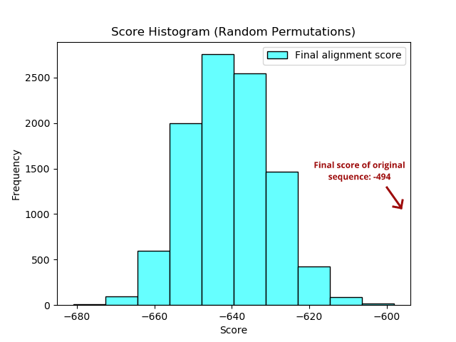
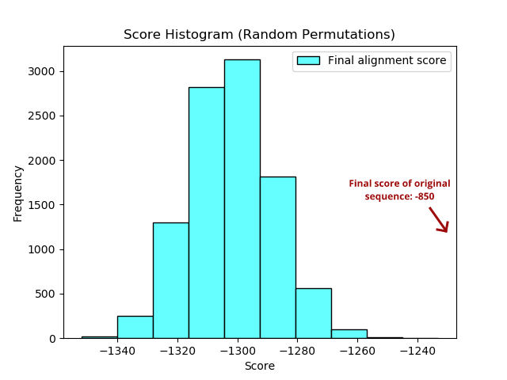

The below histograms are based on Task 4 in the assignment, which involves randomly permuting the query and reference sequences 10,000 times each (i.e. for HOX and PAX) and performing Needleman-Wunsch alignment (not anchored) on each permutation.

## HOX Protein Histogram
</img>

## PAX Protein Histogram
</img>
